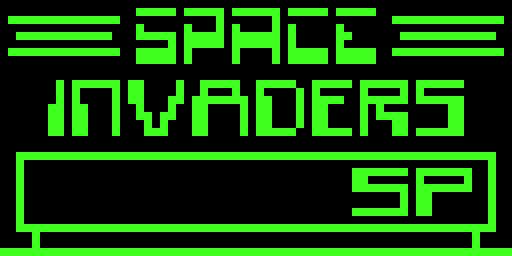
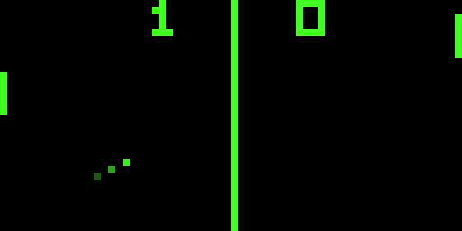

# 🎮 CHIP-8 Interpreter

<div align="center">
  
  
  
  
  
  **A high-performance CHIP-8 Interpreter written in Rust with SDL2**
  
</div>

---

## ✨ Features

- 🎨 **Customizable Display** - Adjustable colors, scale, and refresh rate
- 📼 **GIF Recording** - Capture gameplay moments with built-in recording
- ⚙️ **Configurable** - TOML-based configuration for easy customization

## 🎯 Demos

<div align="center">
  <table>
    <tr>
      <td align="center">
        
        <br />
        <em>Classic Game Running</em>
      </td>
      <td align="center">
        
        <br />
        <em>PONG2 in Action</em>
      </td>
    </tr>
  </table>
  </div>

## 🚀 Quick Start

### Prerequisites

- Rust (1.70 or later)
- SDL2 development libraries

### Installation

```bash
# Clone the repository
git clone https://github.com/Atropos-Dad/Chiper.git
cd Chiper

# Build the project
cargo build --release

# Run with a ROM
cargo run --release -- path/to/rom.ch8
```

## 🎮 Controls

The CHIP-8 uses a 16-key hexadecimal keypad. Here's the default keyboard mapping:

```
Original CHIP-8 Keypad:      Keyboard Mapping:
┌───┬───┬───┬───┐            ┌───┬───┬───┬───┐
│ 1 │ 2 │ 3 │ C │            │ 1 │ 2 │ 3 │ 4 │
├───┼───┼───┼───┤            ├───┼───┼───┼───┤
│ 4 │ 5 │ 6 │ D │            │ Q │ W │ E │ R │
├───┼───┼───┼───┤            ├───┼───┼───┼───┤
│ 7 │ 8 │ 9 │ E │            │ A │ S │ D │ F │
├───┼───┼───┼───┤            ├───┼───┼───┼───┤
│ A │ 0 │ B │ F │            │ Z │ X │ C │ V │
└───┴───┴───┴───┘            └───┴───┴───┴───┘
```

### Special Keys

- **Ctrl + R** - Start/Stop GIF recording

## 🔧 Development

```bash
# Run tests
cargo test

# Run with debug output
cargo run -- --debug rom.ch8

# Check code
cargo check
cargo clippy
```

## 🙏 Acknowledgments

- CHIP-8 was originally developed by Joseph Weisbecker
- SDL2 bindings for Rust by the rust-sdl2 team
- The amazing CHIP-8 community for documentation and test ROMs

---